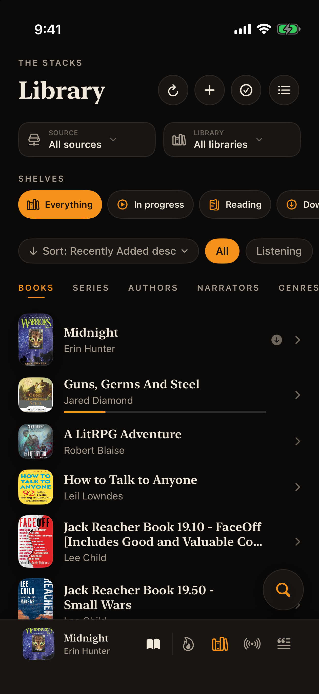
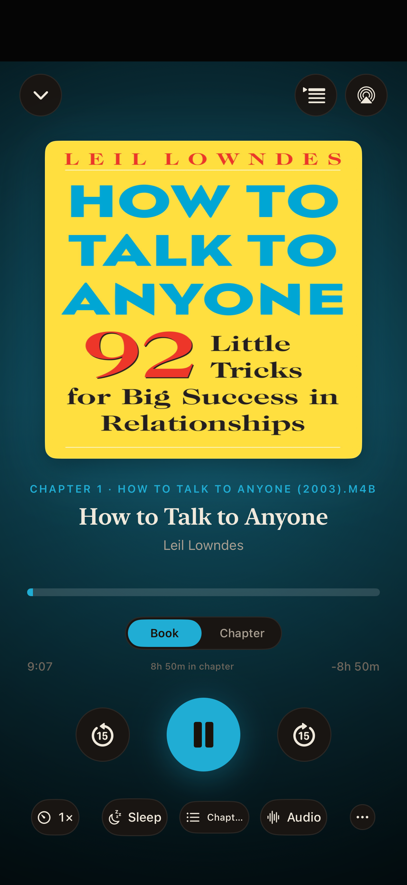
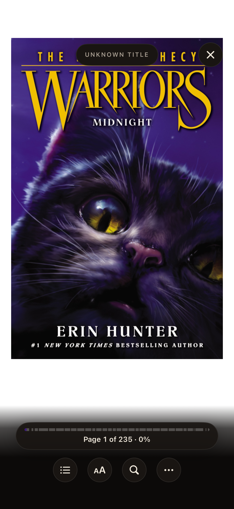

<p align="center">
  
</p>

<h1 align="center">Enve Book Player</h1>

<p align="center">
  A native iPhone and iPad app for audiobooks, ebooks, comics, and podcasts from your own files and self-hosted libraries.
</p>

<p align="center">
  <a href="https://envemedia.com/books/"></a>
  <a href="https://github.com/opisaac9001/Enve-Book-Player/actions/workflows/ios-ci.yml"></a>
  <a href="https://github.com/opisaac9001/Enve-Book-Player/issues"></a>
  <a href="https://github.com/opisaac9001/Enve-Book-Player/discussions"></a>
  <a href="https://discord.gg/Hw4nmXRehb"></a>
  <a href="https://buymeacoffee.com/envebookplayer"></a>
  <a href="./LICENSE.md"></a>
</p>

Enve brings listening and reading together without requiring an Enve account, subscription, or cloud service. Connect the servers you already run, import local files, and keep your library and progress under your control.

This repository contains the iPhone and iPad source. The [Android edition](https://envemedia.com/books/#android) is in open testing, but its source is not public yet.

The public repository follows stable releases. Day-to-day development happens privately, so `main` is updated in reviewed, release-sized snapshots rather than carrying unfinished work.

## What it does

| | |
| :---: | --- |
| 🎧 | **Listen** — Audiobooks and podcasts with chapters, queues, sleep timers, bookmarks, CarPlay, and offline downloads. |
| 📖 | **Read** — EPUB books and comics with a native Readium-based reader, annotations, themes, and reading controls. |
| 🔄 | **Keep your place** — Playback and reading progress sync with supported servers and optional sync services. |
| 📚 | **Bring libraries together** — One library across multiple sources, with duplicate-edition merging where possible. |
| 🔊 | **Read along** — Synchronized text and audio for compatible books. |
| 📊 | **Track and organize** — Collections, smart shelves, reading statistics, a journal, widgets, and an Apple Watch companion. |

## Screenshots

<p align="center">
  
  
  
</p>

<p align="center">
  
  
  
</p>

## Supported libraries and services

Enve works with local files and a broad range of self-hosted services:

| | Supported sources |
| :---: | --- |
| 🎧 | **Audiobook and media servers:** Audiobookshelf, Plex, Jellyfin, Emby, Storyteller, Grimmory, BookOrbit, and Silo |
| 📚 | **Comics and ebooks:** Komga, Kavita, and OPDS catalogs |
| 🗂️ | **Files and feeds:** Local files, WebDAV, SMB, and RSS podcasts |
| ☁️ | **Cloud and debrid:** Premiumize, Real-Debrid, and TorBox |

Provider capabilities differ. The [documentation](https://envemedia.com/docs/) has current setup instructions and service-specific notes.

## Get the app

Current TestFlight and availability information lives on the [Enve Book Player page](https://envemedia.com/books/). Enve is free, contains no advertising or analytics, and does not place a cloud service between the app and your library.

## Building from source

You need Xcode 26.4 or newer, an Apple-silicon Mac, and an iOS 17 or newer deployment target.

```sh
git clone --recurse-submodules https://github.com/opisaac9001/Enve-Book-Player.git
cd Enve-Book-Player
open enve.xcodeproj
```

Let Swift Package Manager resolve dependencies, then build the `enve` scheme for an Apple-silicon iOS Simulator. Device builds require your own Apple development team, bundle identifiers, and entitlements. Optional Google Drive and Dropbox support also require developer-owned OAuth applications.

The complete setup and signing notes are published with the source in `DEVELOPMENT.md`.

## Contributing

Bug fixes, accessibility improvements, provider work, documentation, and focused features are welcome. Start with [CONTRIBUTING.md](CONTRIBUTING.md). Use [Discussions](https://github.com/opisaac9001/Enve-Book-Player/discussions) for questions and early ideas, and Issues for reproducible bugs or agreed work.

For app support and setup questions, use the central [Enve Support repository](https://github.com/opisaac9001/Enve-Support) or [Discord](https://discord.gg/Hw4nmXRehb). Please report security problems privately as described in [SECURITY.md](SECURITY.md).

<details>
<summary><strong>Using a coding agent</strong></summary>

This repository includes detailed instructions for coding agents. Ask the agent to read [`CLAUDE.md`](CLAUDE.md), [`AGENTS.md`](AGENTS.md), and [`DEVELOPMENT.md`](DEVELOPMENT.md) before it makes changes.

Files beginning with `// AGENT-LOCKED` have extra safeguards because they are easy to break without understanding their invariants. The owner-set password is local and advisory: it guides cooperative tools, but it is not encryption or a security boundary. Human contributors can inspect the source normally and should edit protected files only when they understand and can fully test the affected behavior.

</details>

## Important links

| Resource | Link |
| --- | --- |
| Enve Media | [envemedia.com](https://envemedia.com/) |
| iOS Book Player and downloads | [envemedia.com/books](https://envemedia.com/books/) |
| Android edition | [Status and open testing](https://envemedia.com/books/#android) |
| Documentation | [envemedia.com/docs](https://envemedia.com/docs/) |
| FAQ | [envemedia.com/faq](https://envemedia.com/faq.html) |
| Questions and ideas | [GitHub Discussions](https://github.com/opisaac9001/Enve-Book-Player/discussions) |
| Bugs and tracked work | [GitHub Issues](https://github.com/opisaac9001/Enve-Book-Player/issues) |
| General Enve support | [Enve Support](https://github.com/opisaac9001/Enve-Support) |
| Community | [Discord](https://discord.gg/Hw4nmXRehb) |
| Support development | [Buy Me a Coffee](https://buymeacoffee.com/envebookplayer) |

## License

Enve is **source-available**, not OSI open source. It is distributed under the [Enve Noncommercial Public Source License](LICENSE.md). Personal use, study, modification, and noncommercial community contributions are permitted. Commercial use, paid redistribution, advertising, monetization, and closed-source forks are prohibited.

[Third-party notices](THIRD_PARTY_NOTICES.md) list the licenses and attribution requirements for dependencies, bundled resources, and provider artwork. They are legal notices for redistribution, not additional setup instructions.
