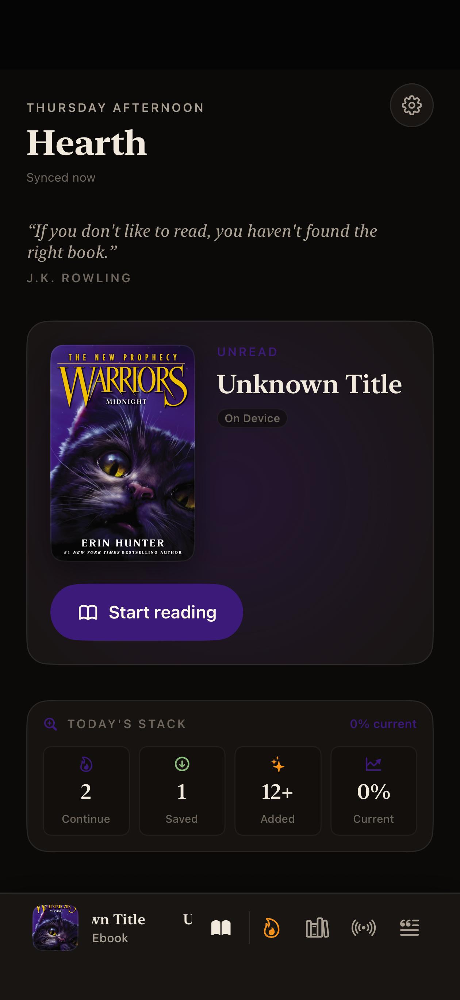
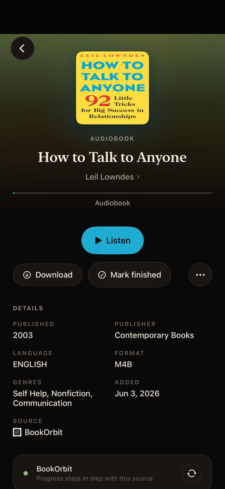
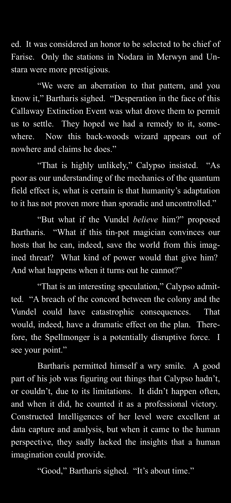

<p align="center">
  
</p>

<h1 align="center">Enve Book Player</h1>

<p align="center">
  Native iOS and Android apps for audiobooks, ebooks, comics, and podcasts from your own files and self-hosted libraries.
</p>

<p align="center">
  <a href="https://envemedia.com/books/"></a>
  <a href="https://envemedia.com/books/#android"></a>
  <a href="https://github.com/opisaac9001/Enve-Book-Player/actions/workflows/ios.yml"></a>
  <a href="https://github.com/opisaac9001/Enve-Book-Player/actions/workflows/android.yml"></a>
  <a href="https://github.com/opisaac9001/Enve-Book-Player/issues"></a>
  <a href="https://github.com/opisaac9001/Enve-Book-Player/discussions"></a>
  <a href="https://discord.gg/Hw4nmXRehb"></a>
  <a href="https://buymeacoffee.com/envebookplayer"></a>
  <a href="./LICENSE.md"></a>
</p>

Enve brings listening and reading together without requiring an Enve account, subscription, or cloud service. Connect the servers you already run, import local files, and keep your library and progress under your control.

This repository contains both editions: the Swift app under [`ios/`](ios/) and the Kotlin/Compose app under [`android/`](android/). The two apps share product behavior and architectural vocabulary while remaining native to their platforms.

The public repository follows stable releases. Day-to-day development happens privately, so `main` is updated in reviewed, release-sized snapshots rather than carrying unfinished work.

## What it does

| | |
| :---: | --- |
| 🎧 | **Listen** — Audiobooks and podcasts with chapters, queues, sleep timers, bookmarks, CarPlay, and offline downloads. |
| 📖 | **Read** — EPUB books and comics with a native Readium-based reader, annotations, themes, and reading controls. |
| 🔄 | **Keep your place** — Playback and reading progress sync with supported servers and optional sync services. |
| 📚 | **Bring libraries together** — One library across multiple sources, with duplicate-edition merging where possible. |
| 🔊 | **Read along** — Synchronized text and audio for compatible books. |
| 📊 | **Track and organize** — Collections, smart shelves, reading statistics, a journal, widgets, and platform companion experiences. |

## Screenshots

These screenshots show the iOS edition. Android follows the same Enve product direction with a native Compose interface.

<p align="center">
  
  
  
</p>

<p align="center">
  
  
  
</p>

## Supported libraries and services

Enve works with local files and a broad range of self-hosted services:

| | Supported sources |
| :---: | --- |
| 🎧 | **Audiobook and media servers:** Audiobookshelf, Plex, Jellyfin, Emby, Storyteller, Grimmory, BookOrbit, and Silo |
| 📚 | **Comics and ebooks:** Komga, Kavita, and OPDS catalogs |
| 🗂️ | **Files and feeds:** Local files, WebDAV, SMB, and RSS podcasts |
| ☁️ | **Cloud and debrid:** Premiumize, Real-Debrid, and TorBox |

Provider capabilities differ. The [documentation](https://envemedia.com/docs/) has current setup instructions and service-specific notes.

Self-hosted SSO requires exact callback values. See [OIDC, SSO, and browser sign-in](docs/guides/oidc.md) for the complete iOS and Android service audit and setup for Audiobookshelf, Grimmory, BookOrbit, Komga, and Storyteller.

## Get the app

Current TestFlight, Android testing, and availability information lives on the [Enve Book Player page](https://envemedia.com/books/). Enve is free, contains no advertising or analytics, and does not place a cloud service between the app and your library.

## Repository layout

| Platform | Source | Development guide | CI |
| --- | --- | --- | --- |
| iOS, iPadOS, watchOS, tvOS | [`ios/`](ios/) | [ios/DEVELOPMENT.md](ios/DEVELOPMENT.md) | [iOS CI](https://github.com/opisaac9001/Enve-Book-Player/actions/workflows/ios.yml) |
| Android and Wear OS | [`android/`](android/) | [android/DEVELOPMENT.md](android/DEVELOPMENT.md) | [Android CI](https://github.com/opisaac9001/Enve-Book-Player/actions/workflows/android.yml) |

## Building from source

Clone once with submodules for either platform:

```sh
git clone --recurse-submodules https://github.com/opisaac9001/Enve-Book-Player.git
cd Enve-Book-Player
```

### iOS

You need Xcode 26.4 or newer, an Apple-silicon Mac, and an iOS 17 or newer deployment target.

```sh
cd ios
open enve.xcodeproj
```

Let Swift Package Manager resolve dependencies, then build the `enve` scheme for an Apple-silicon iOS Simulator. Device builds require your own Apple development team, bundle identifiers, and entitlements. Optional Google Drive and Dropbox support also require developer-owned OAuth applications.

The complete iOS setup and signing notes are in [ios/DEVELOPMENT.md](ios/DEVELOPMENT.md).

### Android

You need Android Studio, JDK 17 or newer, Android SDK 36, and Android NDK 27.2.12479018. Android 8.0 (API 26) is the minimum supported version.

```sh
cd android
./gradlew :app:assembleDebug
```

The release build is unsigned and requires your own signing configuration. See [android/README.md](android/README.md) and [android/DEVELOPMENT.md](android/DEVELOPMENT.md) for the module map, device commands, Wear OS target, and full verification workflow.

## Contributing

Bug fixes, accessibility improvements, provider work, documentation, and focused features are welcome. Start with [CONTRIBUTING.md](CONTRIBUTING.md); Android contributors should also read [android/CONTRIBUTING.md](android/CONTRIBUTING.md). Use [Discussions](https://github.com/opisaac9001/Enve-Book-Player/discussions) for questions and early ideas, and Issues for reproducible bugs or agreed work.

For app support and setup questions, use the central [Enve Support repository](https://github.com/opisaac9001/Enve-Support) or [Discord](https://discord.gg/Hw4nmXRehb). Please report security problems privately as described in [SECURITY.md](SECURITY.md).

## Using AI coding agents

Enve includes repository instructions for working with Codex, Claude Code, and other coding agents. Start with the root [`CLAUDE.md`](CLAUDE.md) and [`AGENTS.md`](AGENTS.md), then read the platform-specific guides under [`ios/`](ios/) or [`android/`](android/) before asking an agent to inspect or change application code.

Keep each task focused on one platform and give the agent a clear outcome, relevant files, and acceptance criteria. Generated changes are drafts: review the complete diff, run the platform's required build and tests, and exercise user-facing changes before submitting them.

Files beginning with `// AGENT-LOCKED` have extra safeguards because they are easy to break without understanding their invariants. The owner-set password is local and advisory: it guides cooperative tools, but it is not encryption or a security boundary. Human contributors can inspect the source normally and should edit protected files only when they understand and can fully test the affected behavior.

## Acknowledgements

Enve would not exist in its current form without the open-source reading, audiobook, comic, and self-hosting communities.

The projects below have been especially valuable as foundations, API and protocol references, implementation examples, and sources of design inspiration. Enve is an independent project and is not affiliated with or endorsed by these projects.

### Open-source projects

#### Core reading and alignment technology

- [Readium Swift Toolkit](https://github.com/readium/swift-toolkit) and [Readium Kotlin Toolkit](https://github.com/readium/kotlin-toolkit) — the foundations of Enve's EPUB reading support.
- [Foliate JS](https://github.com/johnfactotum/foliate-js) — an invaluable reading engine and reference for modern ebook behavior.
- [StoryAlign](https://codeberg.org/richwaters/StoryAlign) — the technology behind Enve's local audiobook and ebook alignment features.

#### Servers, protocols, and integrations

- [Audiobookshelf](https://github.com/advplyr/audiobookshelf) and the [Audiobookshelf mobile app](https://github.com/advplyr/audiobookshelf-app) — essential references for audiobook libraries, playback, progress synchronization, and the Audiobookshelf API.
- [Storyteller](https://gitlab.com/storyteller-platform/storyteller) — for pioneering aligned ebook and audiobook experiences and providing the ecosystem behind Enve's read-aloud support.
- [Grimmory](https://github.com/grimmory-tools/grimmory) — for its ebook and audiobook server, its source, and the help provided by its community and developers.
- [Komga](https://github.com/gotson/komga) and [Komelia](https://github.com/Snd-R/Komelia) — important references for comic, manga, and ebook library integration.
- [Kavita](https://github.com/Kareadita/Kavita) and [BookOrbit](https://github.com/bookorbit/bookorbit) — for their open APIs and work in self-hosted book libraries.
- [KOReader](https://github.com/koreader/koreader), [KOReader Sync Server](https://github.com/koreader/koreader-sync-server), and [ABS–KOReader Sync Bridge](https://github.com/cporcellijr/abs-kosync-bridge) — invaluable references for cross-device reading-position synchronization.

#### Reader and player inspiration

- [Silveran Reader](https://github.com/kyonifer/Silveran-Reader) — for its Storyteller integration and aligned reading work across Apple platforms.
- [AudioBooth](https://github.com/AudioBooth/AudioBooth) — for additional perspective on native audiobook playback.
- [Thorium Reader](https://github.com/edrlab/thorium-reader) — for its ideas and examples of modern reading experiences.

Thank you to every developer and contributor behind these projects for making your work available to learn from.

### Community contributors

#### First Movers

A special thank-you to Enve's First Movers—the original members who joined the Discord early and supported the project from the beginning:

`bobdole_04`, `cowcorner183`, `dacmcbibs`, `donutking1`, `dscab00se07`, `islandbayboy.`, `jacobevans`, `leram84`, `luxorator`, `mjolbat`, `quantumpete`, `pozzy77.`, `queenofravens`, `rhino4293`, `sipko13`, `sirataxero`, and `wrzatko`.

Thank you for believing in Enve while it was still taking shape.

#### Testing and feedback

Thank you to the community members who have repeatedly tested early builds, reproduced difficult bugs, shared recordings and screenshots, explained their workflows, suggested features, and patiently retested fixes:

`bgetsios`, `charlieeee6368`, `darkpixx`, `dhfisher_`, `erictb`, `kirk6893`, `luckyandlee`, `m3enzo`, `originalme8`, `oublic`, `tim3615`, and `tsfxpro`.

Your feedback has directly helped shape Enve on both iOS and Android. Thank you as well to everyone else who has reported an issue, answered a question, tested a release, or shared an idea—the app is better because of you.

#### Friends from other projects

Special thanks to **Ally**, a moderator in the Grimmory community, for being consistently generous with guidance and help.

Thank you also to **kyonifer** and **smoores** from the Storyteller community for patiently answering questions and sharing their knowledge. They may not be Enve users, but their help has made Enve's Storyteller and read-aloud support better.

### Financial supporters

Enve is especially grateful to its financial supporters:

- `colleen`
- `Beleval`
- `leram84`

Thank you for directly supporting Enve's continued development.

## Important links

| Resource | Link |
| --- | --- |
| Enve Media | [envemedia.com](https://envemedia.com/) |
| iOS Book Player and downloads | [envemedia.com/books](https://envemedia.com/books/) |
| Android edition | [Source](android/) · [Status and open testing](https://envemedia.com/books/#android) |
| Documentation | [envemedia.com/docs](https://envemedia.com/docs/) |
| FAQ | [envemedia.com/faq](https://envemedia.com/faq.html) |
| Questions and ideas | [GitHub Discussions](https://github.com/opisaac9001/Enve-Book-Player/discussions) |
| Bugs and tracked work | [GitHub Issues](https://github.com/opisaac9001/Enve-Book-Player/issues) |
| General Enve support | [Enve Support](https://github.com/opisaac9001/Enve-Support) |
| Community | [Discord](https://discord.gg/Hw4nmXRehb) |
| Support development | [Buy Me a Coffee](https://buymeacoffee.com/envebookplayer) |

## License

Enve is **source-available**, not OSI open source. It is distributed under the [Enve Noncommercial Public Source License](LICENSE.md). Personal use, study, modification, and noncommercial community contributions are permitted. Commercial use, paid redistribution, advertising, monetization, and closed-source forks are prohibited.

[Third-party notices](THIRD_PARTY_NOTICES.md) list the licenses and attribution requirements for dependencies, bundled resources, and provider artwork. They are legal notices for redistribution, not additional setup instructions.
